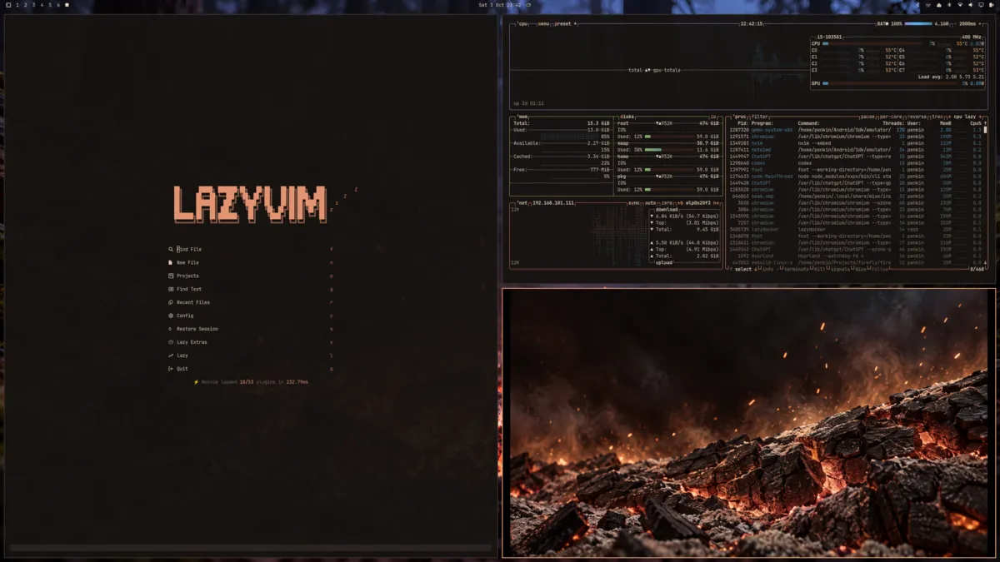

# Cendre for Omarchy

A warm, dark Omarchy theme based on [Cendre](https://cendretheme.com/) by [aejkatappaja](https://github.com/Aejkatappaja/cendre). Ash-black surfaces, cream text, copper accents and brass window borders, with three wallpapers built around glowing wood, ash and smoke.

[](assets/themes/cendre.png)

## Install

Requires an Omarchy version that supports `colors.toml` themes. Install from a terminal:

```bash
omarchy theme install https://github.com/penkin/omarchy-cendre-theme
```

This installs and applies the theme as **Cendre**. The installer replaces any existing user theme named `cendre`; back up that directory first if you've customized it.

To apply it again or cycle the wallpapers:

```bash
omarchy theme set cendre
omarchy theme bg next
```

Choose another theme from Omarchy's theme picker whenever you want to switch back.

## Colors

The palette uses Cendre's **hard** background depth. The active window border runs from ember to brass.

| Color | Hex | Use |
| --- | --- | --- |
| Ash bed | `#171311` | Background |
| Ink | `#e6d5c2` | Foreground |
| Ember | `#ea9875` | Accent |
| Brass | `#fcba81` | Yellow and border highlight |
| Sap | `#99af6b` | Green |
| Cinder | `#d1766e` | Red |
| Frost | `#4e89a2` | Cyan |

`colors.toml` supplies the palette. Omarchy generates the shell, terminal and supported app configs from its own templates, so coverage depends on your installed Omarchy version.

Downloaded themes cannot supply terminal configs or Lua directly. The generated terminal palette can differ slightly from upstream Cendre's ANSI slots, and the default generated Neovim theme uses Omarchy's own color mapping.

## Optional native Cendre for Neovim

For Cendre's original syntax highlighting, add the following to your personal LazyVim plugin configuration, for example `~/.config/nvim/lua/plugins/cendre.lua`:

```lua
return {
  {
    "Aejkatappaja/cendre",
    lazy = false,
    priority = 1000,
    opts = {
      background = "hard",
      italic_comments = false,
      italic_virtual_text = false,
    },
  },
  {
    "LazyVim/LazyVim",
    opts = { colorscheme = "cendre" },
  },
}
```

Restart Neovim and let Lazy install the plugin. This is a personal editor preference: it selects Cendre on startup independently of the desktop theme. Omarchy's theme hot-reload can still change the running editor when you switch desktop themes.

## Wallpapers

The three PNGs are 1672 × 941 pixels. Omarchy scales them to your display.

- [Ember Atlas](backgrounds/01-ember-atlas.png): cracked charcoal, copper heat and drifting sparks.
- [Ash Veil](backgrounds/02-ash-veil.png): a glowing seam beneath ribbons of smoke.
- [Last Light](backgrounds/03-last-light.png): fading coals on a misty forest floor.


The wallpapers were AI-generated with OpenAI image generation. An existing wallpaper served as a reference for lighting, texture and atmosphere; the subjects come from Cendre's wood-fire concept. The reference image is not included. The [generation prompts](docs/wallpaper-prompts.json) are included; their requested size differs from the delivered image dimensions above.

## Credits and license

Cendre's palette and original Neovim theme are by [aejkatappaja](https://github.com/Aejkatappaja/cendre), under the MIT license. This independent Omarchy adaptation and its accompanying wallpapers were assembled by [penkin](https://github.com/penkin).

Repository contents are provided under the [MIT license](LICENSE), including the generated wallpapers to the extent rights can be granted. The upstream copyright notice is preserved.
